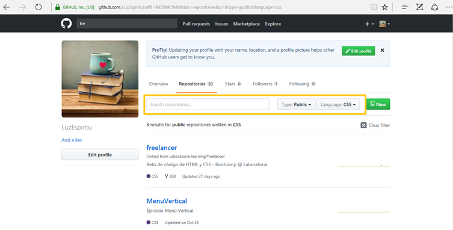

## Identifica los elementos de navegación en los siguientes sites

 Breather
 Github
 Medium

1. **Breather**
    **Navegación Global*
    .
    .

    **Navegación Local*
    .

    **Filto*
     .
    .

2. **Github**
    **Navegación Global*
    .
    **Navegación Local*
    .

    **Filto*
    .

    **Facetada*
    .

     **En Línea*
     .

     **Filto*
     .
     
    **Facetada*
    .